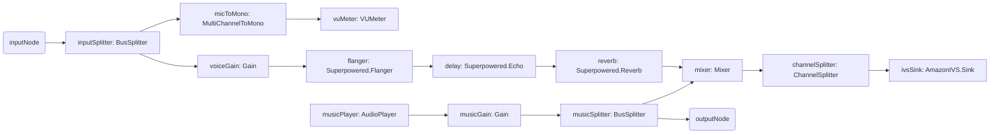

# Karaoke App with Interactive Audio Effects using the Switchboard SDK and Amazon IVS

This repository hosts the source code for a Karaoke App developed using the Switchboard SDK and Amazon Interactive Video Service (IVS). This sample app demonstrates how to create an engaging karaoke experience with live interactive audio effects. The step-by-step guide to building this app is detailed in our [blog post](https://community.aws/content/2bjOZXGNZtYebdF5GQvE5Tk1SK2/add-interactive-audio-to-amazon-ivs-live-streams-with-the-switchboard-sdk-karaoke-app-example).

NOTE: The main branch features a more advanced version of the Karaoke App. For the version discussed in the blog post, check out the <a href="https://github.com/switchboard-sdk/karaoke-ivs-app-android/tree/blogpost-version/" target="_blank">blogpost-version</a> branch.

## Important Links

<a href="https://docs.switchboard.audio/" target="_blank">Switchboard SDK</a>

<a href="https://docs.aws.amazon.com/ivs/" target="_blank">Amazon IVS</a>

<a href="https://community.aws/content/2bjOZXGNZtYebdF5GQvE5Tk1SK2/add-interactive-audio-to-amazon-ivs-live-streams-with-the-switchboard-sdk-karaoke-app-example" target="_blank">Blog post</a>

## Setup

No manual setup step is required. The SwitchboardSDK and its Superpowered, AudioEffects and Amazon IVS extensions are declared as Gradle dependencies (see `gradle/libs.versions.toml`) and resolved automatically from Maven when you build. Just open the project in Android Studio, or run:

```
./gradlew assembleDebug
```

The app targets **SwitchboardSDK 3.2.4** and is built with **Jetpack Compose** for the UI and the **v3 JSON audio-graph API** for the audio engine.

To stream, add your IVS credentials in **Settings**: an ingest server and stream key for broadcast, or a publisher/listener token for the real-time Stage examples.

## Examples

### Karaoke with Broadcast IVS

Sing over a backing track with effects and broadcast the mix to an IVS channel. The microphone is metered and, through a Flanger/Echo/Reverb chain, mixed with a looping backing track; the mix is sent to Amazon IVS via an `AmazonIVS.Sink` node while the backing track alone is monitored locally.



### Karaoke with Real-Time IVS (Stage)

Sing over a backing track and publish to an IVS Stage in real time. The microphone runs through a harmonizer (a `SubgraphProcessor` of pitch-correction plus dual pitch shift) and a Vibrato/Chorus/Flanger/Echo/Reverb chain, is mixed with the backing track, and the mix is sent to the Stage via `AmazonIVS.Sink` and recorded for local playback.

### Real-Time IVS Listener

Joins an IVS Stage as an audio-only subscriber to listen to a real-time karaoke performance.
